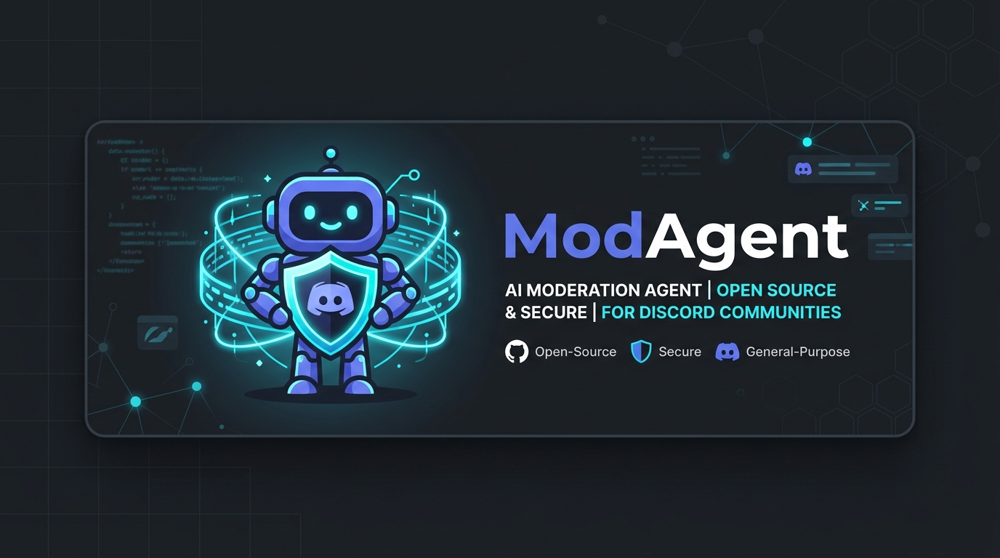

# mod-agent-for-discord



LLM-powered, **context-aware** Discord moderation and community agent. Understands sarcasm, gaming banter and context where regex bots (Carl-bot, MEE6) see only keywords — and it talks to your members so you don't have to.

**Human-in-the-loop by design: the bot never bans, never deletes, never times out. It flags, analyzes and recommends; your moderators decide.**

### Why ModAgent?

| Feature | 🛡️ Standard Bots / AutoMod | 🧠 ModAgent (AI-Powered) |
| :--- | :--- | :--- |
| **Context Awareness** | ❌ **No**: Flags keywords blindly, ignoring game banter or sarcasm (e.g. flags "kill" in game chat). |  **Yes**: Reads chat history to understand context, slang, and true user intent. |
| **Scam & Spam Detection** | ⚠️ **Basic**: Only blocks blacklisted links. Misses new domains or obfuscated text. |  **Semantic**: Recognizes the *intent* of "free nitro", account trading, or phishing, regardless of links. |
| **Moderation Style** | 🤖 **Auto-ban/Mute**: Rigid actions that frustrate users and cause false positives. | 🧑‍✈️ **Human-in-the-loop**: Never auto-bans. Generates detailed reports in your staff channel; mods decide. |
| **Community Engagement** | ❌ **None**: Only moderates, doesn't interact. |  **Active**: Autonomously welcomes new users, answers FAQ questions, and writes proactive posts. |
| **Staff Reports** | ❌ **Raw logs only**: Hard-to-read audit trails. | 📊 **Daily Digest**: Summarizes server health, flag statistics, and API costs in a single friendly report. |

## How it works

```
message ──► regex pre-filter (free) ──► cheap LLM classifier ──► strong LLM review ──► flag in #mod channel
                 │ no match                    │ "ok"                (serious cases only)   with recommendation
                 ▼                             ▼
          member interactions            dropped quietly
          (mentions, questions,          (false positive)
           welcomes, digest)
```

Three-stage cost control:

1. **Regex pre-filter** — zero cost. Only suspicious messages (invite links, nitro scams, mention spam, ...) ever reach an LLM.
2. **Cheap classifier** (e.g. `glm-4-flash`, `claude-haiku-4-5`) — categorizes: spam / scam / harassment / leak file sharing / toxicity, with severity and confidence. Confident "ok" verdicts are dropped as false positives.
3. **Strong escalation model** (e.g. `glm-4-plus`, `claude-opus-4-8`) — only for serious cases: reads channel context, judges intent vs banter, writes a recommendation for the human mods.

Plus a **hard daily budget cap**: spend is tracked per call; when the cap is hit, LLM calls stop until midnight UTC and moderation degrades gracefully to regex-flag-only.

## Features

- **Moderation flags** — rich embed in your staff channel: message, author, link, classifier verdict, escalation analysis with recommended action.
- **Member Q&A** — answers @mentions and replies anywhere, plus plain questions in configured channels. Uses your FAQ as ground truth. Per-user and per-channel cooldowns.
- **Smart welcomes** — short, varied, personalized welcome for each new member (with a static fallback if the budget is exhausted).
- **Daily digest** — one message a day in the staff channel: activity, new members, flags, bot replies, LLM spend.
- **Bring your own LLM** — works with any OpenAI-compatible endpoint (GLM/Zhipu, Ollama, vLLM, ...) or the Anthropic Claude API.

## Setup

### 1. Create the Discord application

1. [Discord Developer Portal](https://discord.com/developers/applications) → **New Application**.
2. **Bot** tab → enable **Message Content Intent** and **Server Members Intent** (both required).
3. **Reset Token** → copy it into `.env`.
4. Invite the bot: **OAuth2 → URL Generator** → scope `bot` → permissions: *View Channels, Send Messages, Read Message History, Embed Links*. Open the generated URL, pick your server.

### 2. Configure

```bash
git clone https://github.com/<you>/mod-agent-for-discord
cd mod-agent-for-discord
npm install
cp .env.example .env            # add DISCORD_TOKEN + your LLM API key
cp config.example.yaml config.yaml
```

Edit `config.yaml`: at minimum set `server.mod_channel_id` (right-click a channel → Copy Channel ID, with Developer Mode enabled in Discord settings). Review the models, budget cap and persona.

### 3. Run

```bash
npm run dev      # development (auto-reload)
# or
npm run build && npm start
```

### Docker (for a VPS)

```bash
docker build -t mod-agent .
docker run -d --name mod-agent --restart unless-stopped \
  --env-file .env \
  -v ./config.yaml:/app/config.yaml:ro \
  mod-agent
```

## Cost

With the default GLM setup (`glm-4-flash` for classification and chat) a small server costs **cents per month** — the free-tier flash model handles almost everything and the paid escalation model only runs on high-severity cases. The `budget.daily_usd_cap` (default $0.50/day) is a hard stop either way.

## Design principles

- **No auto-actions.** LLMs misread context sometimes; a wrong ban destroys trust in your server. Every action is a human decision.
- **LLM calls are the exception, not the rule.** Most messages cost nothing: regex gate for moderation, mention/question heuristics + cooldowns for chat.
- **Degrade gracefully.** Budget exhausted or API down → regex flagging and template welcomes keep working.
- **Privacy.** Only flagged messages and small context windows are sent to the LLM API. Nothing is stored beyond in-memory daily stats.

## License

MIT
